# Практическое занятие №8: REST API для управления заметками с MongoDB

## Выполнил: Туев Д. ЭФМО-01-25

## Описание проекта

REST API сервис для управления заметками с использованием MongoDB как основного хранилища данных. Система предоставляет полный набор CRUD операций: создание новых заметок, получение списка с поддержкой фильтрации и пагинации, получение заметки по ID, обновление содержимого и удаление. Проект реализован на базе Spring Boot 3.5.7 с использованием Spring Data MongoDB для взаимодействия с базой данных, Spring Cache для кэширования и логированием HTTP запросов.

### Стек технологий

В проекте используются следующие технологии и инструменты:
- **Spring Boot 3.5.7** — основной фреймворк приложения
- **Spring Web** — для разработки REST API
- **Spring Data MongoDB** — интеграция с MongoDB через Repository паттерн
- **Spring Cache** — кэширование данных
- **MongoDB** — NoSQL база данных для хранения заметок
- **Lombok** — сокращение шаблонного кода (геттеры, сеттеры, конструкторы)
- **Maven** — управление зависимостями и сборка проекта
- **Java 17** — язык программирования

### Поддерживаемые запросы

**Легенда:** 🟢 Создание · 🔵 Чтение · 🟠 Обновление · 🔴 Удаление

| Метод | Эндпоинт | Параметры | Действие | Ответ | Тело ответа |
|-------|----------|-----------|----------|-------|-------------|
| 🟢 **POST** | `/api/v1/notes` | - | Создать заметку | `201 CREATED` | `JSON` объект NoteDTO |
| 🔵 **GET** | `/api/v1/notes` | `q` (поиск), `limit` (размер), `skip` (страница) | Получить список заметок с фильтром | `200 OK` | `JSON` массив NoteDTO |
| 🔵 **GET** | `/api/v1/notes/{id}` | `id` (UUID) | Получить заметку по ID | `200 OK` | `JSON` объект NoteDTO |
| 🟠 **PATCH** | `/api/v1/notes/{id}` | `id` (UUID) | Обновить содержимое заметки | `200 OK` | `JSON` объект NoteDTO |
| 🔴 **DELETE** | `/api/v1/notes/{id}` | `id` (UUID) | Удалить заметку | `204 NO_CONTENT` | - |
| 🔵 **GET** | `/health` | - | Проверка здоровья приложения | `200 OK` | `JSON` статус |

### Формат данных

Тело запроса (POST /api/v1/notes):
```json
{
  "title": "My First Note",
  "content": "This is the content of my note"
}
```

Тело запроса (PATCH /api/v1/notes/{id}):
```json
{
  "content": "Updated content"
}
```

Ответ (GET, POST, PATCH):
```json
{
  "id": "550e8400-e29b-41d4-a716-446655440000",
  "title": "My First Note",
  "content": "This is the content of my note",
  "createdAt": "2025-11-18T10:30:00",
  "updatedAt": "2025-11-18T10:30:00"
}
```

Ответ (GET /api/v1/notes с фильтром):
```json
[
  {
    "id": "550e8400-e29b-41d4-a716-446655440000",
    "title": "My First Note",
    "content": "Content",
    "createdAt": "2025-11-18T10:30:00",
    "updatedAt": "2025-11-18T10:30:00"
  }
]
```

### Структура проекта

```
my/learn/mireaffjpractice8/
├── config/
│   └── WebConfig.java                          # Конфигурация MVC и регистрация интерцепторов
├── controller/
│   ├── MainController.java                     # Контроллер для /health и /favicon.ico
│   └── NoteController.java                     # REST API для управления заметками
├── dto/
│   ├── request/
│   │   ├── CreateNoteRequest.java              # DTO для создания заметки
│   │   └── PatchNoteRequest.java               # DTO для обновления заметки
│   └── response/
│       └── NoteDTO.java                        # DTO заметки для ответов
├── exception/
│   ├── AppException.java                       # Базовое исключение приложения
│   └── handler/
│       └── AppExceptionHandler.java            # Глобальный обработчик ошибок
├── interceptor/
│   └── LoggingInterceptor.java                 # Логирование HTTP запросов
├── model/
│   └── Note.java                               # Модель заметки (@Document для MongoDB)
├── repository/
│   └── NoteRepository.java                     # MongoRepository для заметок
├── service/
│   └── NoteService.java                        # Бизнес-логика операций с заметками
├── util/
│   └── NoteDTOMapper.java                      # Маппер для преобразования Note -> NoteDTO
└── MireaFfjPractice8Application.java           # Главный класс приложения
```

## Тестирование

Для тестирования данного API разработана [Postman коллекция](https://lively-flare-564043.postman.co/workspace/My-Workspace~fe2081e8-b325-4776-8b48-400d41f5b4bd/collection/42992055-dbd147c9-cdd6-4e90-ab1b-54ad26d13849?action=share&source=copy-link&creator=42992055)

### Обработка ошибок и коды ответа

| Код | Название | Где обрабатывается | Что значит / когда возвращается |
| :-- | :-- | :-- | :-- |
| 200 | OK | `getNotes`, `getNoteById`, `patchNoteById`, `/health` | Успешный ответ с данными. |
| 201 | Created | `createNote` | Заметка успешно создана в MongoDB. |
| 204 | No Content | `deleteNoteById` | Заметка успешно удалена. |
| 400 | Bad Request | `createNote`, `patchNoteById` | Некорректные данные запроса (пустой JSON, ошибка валидации). |
| 404 | Not Found | `getNoteById`, `patchNoteById`, `deleteNoteById` | Заметка с указанным ID не найдена в MongoDB. |
| 500 | Internal Server Error | `AppExceptionHandler` | Непредвиденная ошибка сервера. |

### Тест кейсы

| № | Наименование | Маршрут | Запрос (пример) | Ожидаемый ответ |
|--|--|--|--|--|
| 1 | Проверка здоровья приложения | **GET /health** | - | 200 OK + JSON статус |
| 2 | Создание заметки | **POST /api/v1/notes** | `{"title":"Note 1","content":"Content"}` | 201 Created + JSON NoteDTO |
| 3 | Получение всех заметок | **GET /api/v1/notes** | - | 200 OK + JSON массив NoteDTO |
| 4 | Получение заметок с поиском | **GET /api/v1/notes?q=Note** | - | 200 OK + JSON массив отфильтрованных NoteDTO |
| 5 | Получение заметок с пагинацией | **GET /api/v1/notes?limit=10&skip=0** | - | 200 OK + JSON массив NoteDTO (максимум 10) |
| 6 | Получение заметки по ID | **GET /api/v1/notes/{id}** | - | 200 OK + JSON NoteDTO |
| 7 | Получение несуществующей заметки | **GET /api/v1/notes/{invalid-id}** | - | 404 Not Found |
| 8 | Обновление содержимого заметки | **PATCH /api/v1/notes/{id}** | `{"content":"Updated"}` | 200 OK + JSON NoteDTO (обновлённый) |
| 9 | Обновление несуществующей заметки | **PATCH /api/v1/notes/{invalid-id}** | `{"content":"Updated"}` | 404 Not Found |
| 10 | Удаление заметки | **DELETE /api/v1/notes/{id}** | - | 204 No Content |
| 11 | Удаление несуществующей заметки | **DELETE /api/v1/notes/{invalid-id}** | - | 404 Not Found |

### Результаты тестирования

#### 1. Проверка здоровья приложения

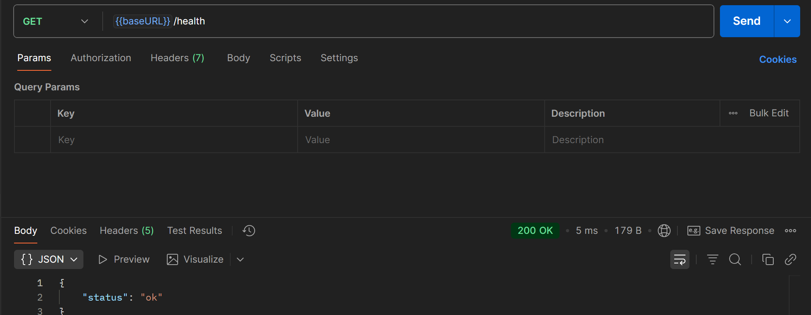

Результат: **HTTP 200 OK**, возвращает статус приложения.

#### 2. Создание заметки

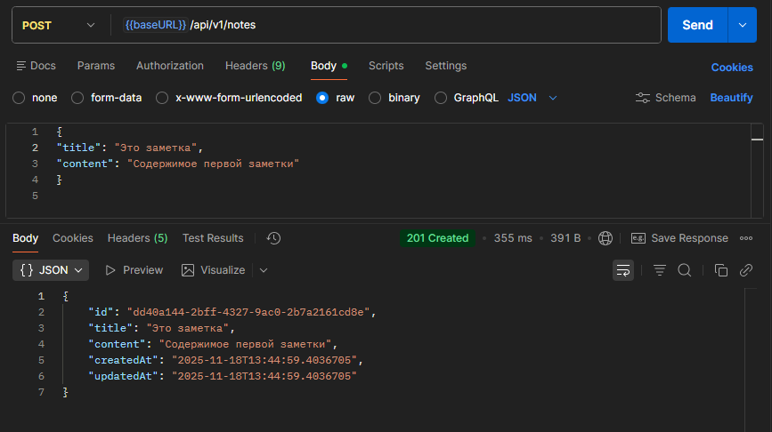

Результат: **HTTP 201 Created**, заметка успешно сохранена в MongoDB с UUID и временными метками.

#### 3. Получение всех заметок

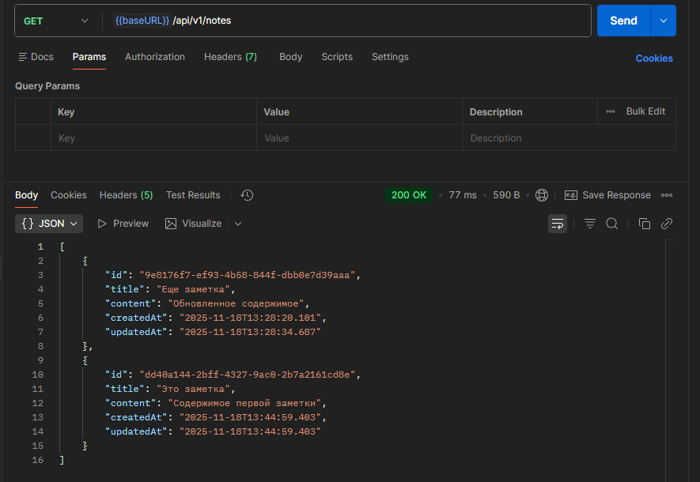

Результат: **HTTP 200 OK**, возвращает полный список всех заметок из коллекции.

#### 4. Получение заметок с поиском

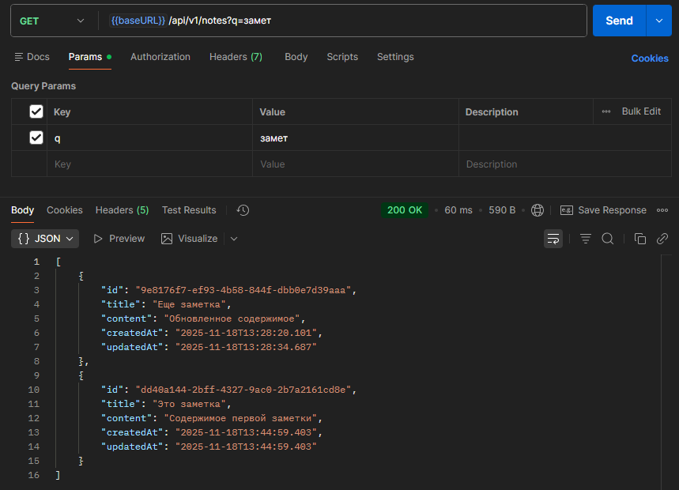

Результат: **HTTP 200 OK**, возвращает заметки, название которых содержит поисковый запрос (без учёта регистра).

#### 5. Получение заметок с пагинацией

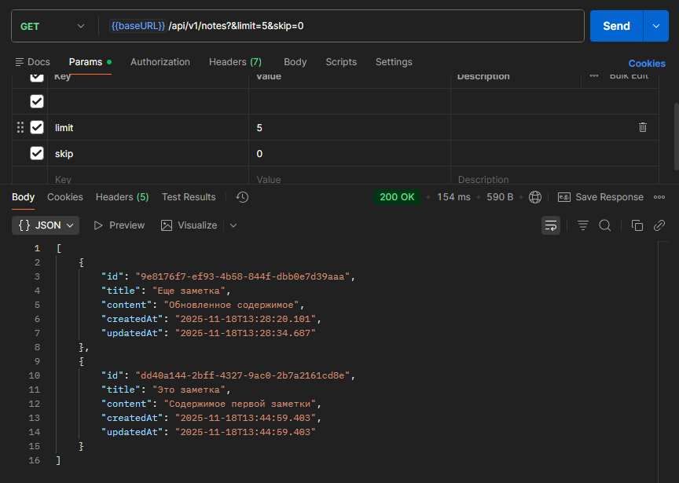

Результат: **HTTP 200 OK**, возвращает ограниченный список заметок согласно параметрам limit и skip.

#### 6. Получение заметки по ID

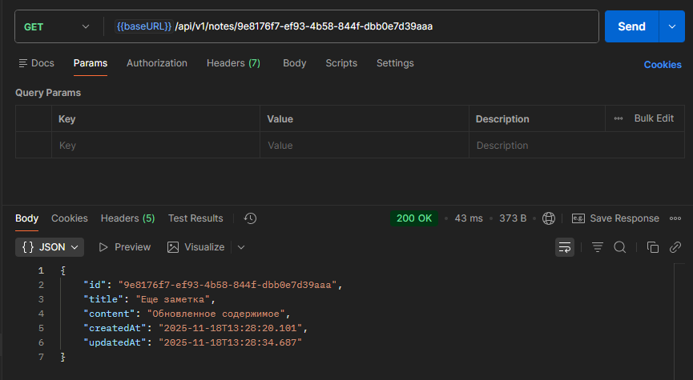

Результат: **HTTP 200 OK**, возвращает заметку с указанным UUID.

#### 7. Получение несуществующей заметки

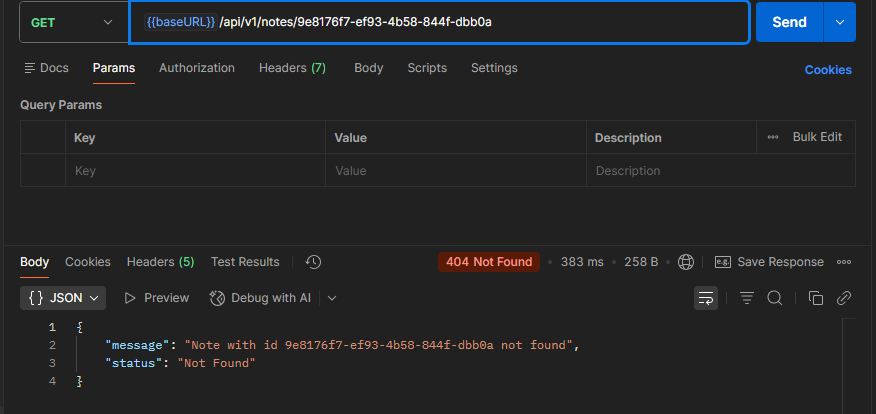

Результат: **HTTP 404 Not Found**, заметка с таким ID не найдена в MongoDB.

#### 8. Обновление содержимого заметки

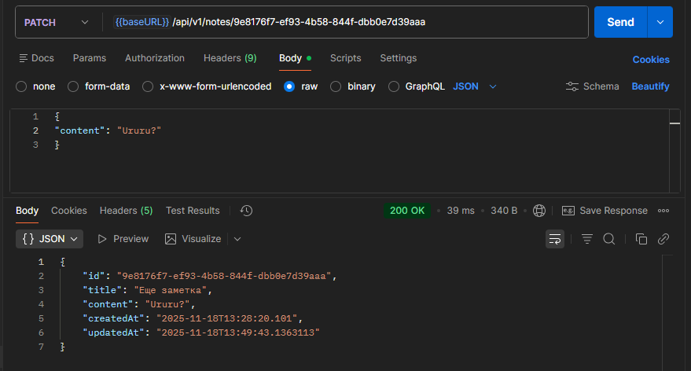

Результат: **HTTP 200 OK**, содержимое заметки обновлено, updatedAt автоматически обновлен.

#### 9. Обновление несуществующей заметки

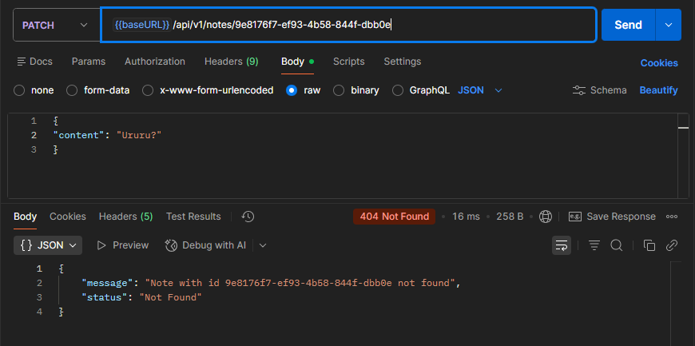

Результат: **HTTP 404 Not Found**, попытка обновить несуществующую заметку.

#### 10. Удаление заметки

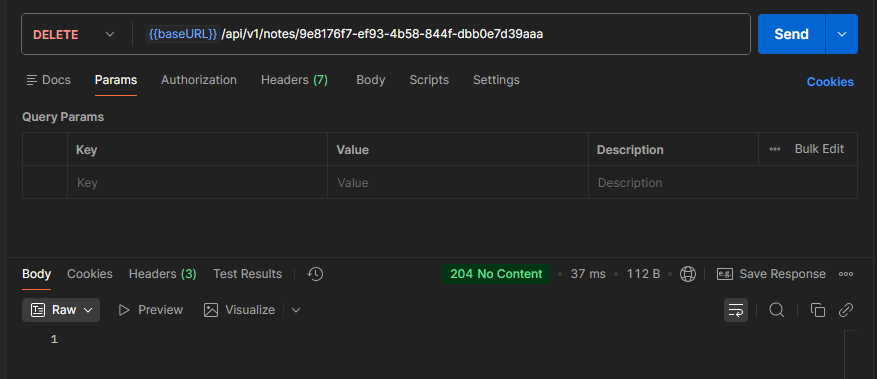

Результат: **HTTP 204 No Content**, заметка успешно удалена из MongoDB.

#### 11. Удаление несуществующей заметки

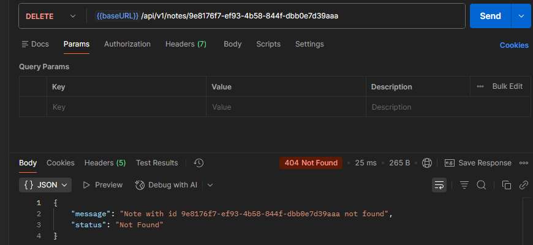

Результат: **HTTP 404 Not Found**, попытка удалить несуществующую заметку.

## Настройка сервера

### Переменные окружения

Для корректной работы приложения необходимо указать следующие переменные окружения в файле `application.properties` или через переменные окружения системы:

| Переменная окружения | Описание | Пример |
|-----------|----------|----------|
| MONGO_URI | URI подключения к MongoDB | mongodb://localhost:27017/notes_db |


**Конфигурация в application.properties:**
```properties
spring.data.mongodb.uri=${MONGO_URI}
```

## Дополнительно

### Теоретические основы

#### MongoDB и документоориентированные БД

MongoDB — это NoSQL база данных, которая хранит данные в виде документов JSON (BSON). Основные преимущества MongoDB:

- **Гибкость** — схема документов может быть динамической
- **Масштабируемость** — встроенная поддержка горизонтального масштабирования (sharding)
- **Производительность** — быстрое получение данных благодаря индексам
- **Язык запросов** — мощный язык запросов с поддержкой агрегации

#### Spring Data MongoDB

Spring Data MongoDB предоставляет удобный способ работы с MongoDB через Repository паттерн:

- **MongoRepository** — интерфейс с методами CRUD операций
- **@Document** — аннотация для определения коллекции MongoDB
- **@Id** — аннотация для определения поля первичного ключа
- **@Indexed** — аннотация для создания индексов

#### UUID как первичный ключ

В проекте используется UUID (Universally Unique Identifier) вместо ObjectId:

- **Уникальность** — очень низкая вероятность коллизий
- **Переносимость** — генерируется на приложении, не зависит от БД
- **Безопасность** — сложнее угадать ID по сравнению с последовательными числами

#### DTO паттерн

DTO (Data Transfer Object) используется для отделения внутреннего представления от API:

- Скрывает детали реализации (например, порядок полей в MongoDB)
- Позволяет валидировать входные данные отдельно
- Упрощает версионирование API

### Ключевые фрагменты кода

#### 1. Модель с @Document

```java
@Document(collection = "notes")
@Data
@Builder
public class Note {
    @Id
    private UUID id;

    @Indexed(unique = true)
    private String title;

    private String content;

    private LocalDateTime createdAt;
    private LocalDateTime updatedAt;
}
```

#### 2. MongoRepository с кастомными методами

```java
public interface NoteRepository extends MongoRepository<Note, UUID> {
    List<Note> findByTitleContainingIgnoreCase(String title);
    List<Note> findByTitleContainingIgnoreCase(String title, PageRequest pageable);
}
```

#### 3. Сервис с CRUD операциями

```java
@Service
@RequiredArgsConstructor
@Transactional
public class NoteService {
    private final NoteRepository noteRepository;

    public Note createNote(CreateNoteRequest req) {
        Note note = Note.builder()
                .id(UUID.randomUUID())
                .title(req.getTitle())
                .content(req.getContent())
                .createdAt(LocalDateTime.now())
                .updatedAt(LocalDateTime.now())
                .build();
        return noteRepository.save(note);
    }

    public List<Note> getNotes(PageRequest pageable, String title) {
        if (pageable == null && title == null) {
            return noteRepository.findAll();
        }
        if (pageable != null && title != null) {
            return noteRepository.findByTitleContainingIgnoreCase(title, pageable);
        }
        if (title != null) {
            return noteRepository.findByTitleContainingIgnoreCase(title);
        }
        return noteRepository.findAll(pageable).stream().toList();
    }

    public Note findById(String id) {
        Note note = noteRepository.findById(UUID.fromString(id)).orElse(null);
        if (note == null) {
            throw new AppException("Note not found", HttpStatus.NOT_FOUND);
        }
        return note;
    }

    public Note patchNote(PatchNoteRequest req, String id) {
        Note note = findById(id);
        note.setContent(req.getContent());
        note.setUpdatedAt(LocalDateTime.now());
        return noteRepository.save(note);
    }

    public void deleteNoteById(String id) {
        Note note = findById(id);
        noteRepository.delete(note);
    }
}
```

#### 4. REST контроллер с полным CRUD

```java
@RestController
@RequiredArgsConstructor
@RequestMapping("/api/v1/notes")
public class NoteController {
    private final NoteService noteService;
    private final NoteDTOMapper mapper;

    @PostMapping
    public ResponseEntity<NoteDTO> createNote(@RequestBody CreateNoteRequest req) {
        return new ResponseEntity<>(
                mapper.toDTO(noteService.createNote(req)),
                HttpStatus.CREATED
        );
    }

    @GetMapping
    public ResponseEntity<List<NoteDTO>> getNotes(
            @RequestParam(value = "q", required = false) String q,
            @RequestParam(value = "limit", required = false) Integer limit,
            @RequestParam(value = "skip", required = false) Integer page) {
        PageRequest p = null;
        if (limit != null && page != null) {
            p = PageRequest.of(page, limit);
        }
        return new ResponseEntity<>(
                noteService.getNotes(p, q).stream()
                    .map(mapper::toDTO).toList(),
                HttpStatus.OK
        );
    }

    @GetMapping("/{id}")
    public ResponseEntity<NoteDTO> getNoteById(@PathVariable("id") String id) {
        return new ResponseEntity<>(
                mapper.toDTO(noteService.findById(id)),
                HttpStatus.OK
        );
    }

    @PatchMapping("/{id}")
    public ResponseEntity<NoteDTO> patchNoteById(
            @PathVariable("id") String id,
            @RequestBody PatchNoteRequest req) {
        return new ResponseEntity<>(
                mapper.toDTO(noteService.patchNote(req, id)),
                HttpStatus.OK
        );
    }

    @DeleteMapping("/{id}")
    public ResponseEntity<Void> deleteNoteById(@PathVariable("id") String id) {
        noteService.deleteNoteById(id);
        return new ResponseEntity<>(HttpStatus.NO_CONTENT);
    }
}
```

#### 5. Глобальная обработка ошибок

```java
@ControllerAdvice
public class AppExceptionHandler {
    @ExceptionHandler
    public ResponseEntity<Object> handleAppException(AppException e) {
        Map<String, String> body = new HashMap<>();
        body.put("message", e.getMessage());
        body.put("status", e.getStatus().getReasonPhrase());
        return new ResponseEntity<>(body, e.getStatus());
    }

    @ExceptionHandler
    public ResponseEntity<Object> handleException(Exception e) {
        Map<String, String> body = new HashMap<>();
        body.put("message", e.getMessage());
        body.put("status", HttpStatus.INTERNAL_SERVER_ERROR.getReasonPhrase());
        return new ResponseEntity<>(body, HttpStatus.INTERNAL_SERVER_ERROR);
    }
}
```

### Контрольные вопросы

#### 1. Чем MongoDB отличается от реляционных БД?

MongoDB — документоориентированная NoSQL БД, в отличие от реляционных БД:

- **Структура данных** — документы JSON вместо таблиц с фиксированной схемой
- **Гибкость** — каждый документ может иметь разную структуру
- **Масштабируемость** — встроенная поддержка горизонтального масштабирования
- **Производительность** — оптимизирована для чтения больших объёмов данных
- **Язык запросов** — собственный язык запросов вместо SQL

#### 2. Что такое коллекция в MongoDB?

Коллекция — аналог таблицы в реляционной БД, но содержит документы JSON вместо записей. Особенности:

- **Динамическая схема** — документы в одной коллекции могут иметь разную структуру
- **Индексы** — поддержка индексов для оптимизации поисков
- **TTL индексы** — автоматическое удаление документов по времени
- **Валидация схемы** — опциональная валидация структуры документов

#### 3. Для чего нужен MongoRepository?

MongoRepository предоставляет встроенные методы для работы с MongoDB:

- **CRUD операции** — save(), findById(), delete(), deleteAll()
- **Поиск** — findAll(), findByX() (методы генерируются автоматически)
- **Пагинация** — findAll(Pageable)
- **Кастомные методы** — разработчик может определить свои методы поиска

#### 4. Что такое @Indexed и зачем его использовать?

@Indexed создаёт индекс на указанное поле:

- **Производительность** — значительно ускоряет поиск по индексированному полю
- **Уникальность** — @Indexed(unique = true) гарантирует уникальность значений
- **Сортировка** — индексы помогают ускорить сортировку
- **Компромисс** — индексы занимают память и замедляют вставку/обновление

#### 5. Почему используется UUID вместо _id?

UUID (Universally Unique Identifier) имеет преимущества:

- **Глобальная уникальность** — очень низкая вероятность коллизий
- **Независимость от БД** — генерируется на приложении
- **Безопасность** — сложнее угадать ID по сравнению с последовательными числами
- **Распределённость** — удобно для распределённых систем без центрального сервера

#### 6. Как работает фильтрация и пагинация в методе getNotes()?

```java
public List<Note> getNotes(PageRequest pageable, String title) {
    // Если ничего не передано - все заметки
    if (pageable == null && title == null) {
        return noteRepository.findAll();
    }
    
    // Если оба параметра - поиск с пагинацией
    if (pageable != null && title != null) {
        return noteRepository.findByTitleContainingIgnoreCase(title, pageable);
    }
    
    // Если только название - поиск
    if (title != null) {
        return noteRepository.findByTitleContainingIgnoreCase(title);
    }
    
    // Если только пагинация - все с ограничением
    return noteRepository.findAll(pageable).stream().toList();
}
```

#### 7. Для чего нужен DTO маппер?

NoteDTOMapper преобразует Entity (Note) в DTO (NoteDTO):

- **Безопасность** — скрывает внутреннюю структуру данных
- **Гибкость** — можно изменить внутреннее представление без влияния на API
- **Валидация** — DTO может содержать отдельные правила валидации
- **Versioning** — разные API версии могут иметь разные DTO

## Выводы

В результате выполнения практического занятия №8 был разработан полнофункциональный REST API сервис для управления заметками с использованием MongoDB как основного хранилища данных. Проект демонстрирует применение лучших практик при работе с NoSQL базами данных в Spring Boot.

**Достигнутые результаты:**

- Реализована полная поддержка CRUD операций (Create, Read, Update, Delete)
- Настроена интеграция Spring Boot с MongoDB через Spring Data MongoDB
- Реализована фильтрация и поиск заметок по названию
- Внедрена пагинация для работы с большими наборами данных
- Использован UUID как первичный ключ вместо стандартного ObjectId
- Применены индексы для оптимизации поиска (уникальный индекс на название)
- Реализована централизованная обработка исключений
- Добавлено логирование HTTP запросов
- Использован DTO паттерн для отделения внутреннего представления от API

**Приобретённые навыки:**

- Интеграция Spring Boot с MongoDB через Spring Data MongoDB
- Использование MongoRepository для работы с документами
- Проектирование и использование индексов в MongoDB
- Применение фильтрации, поиска и пагинации
- Работа с UUID как альтернатива стандартным ID
- Обработка ошибок и создание единообразного формата ответов
- Использование DTO паттерна при работе с NoSQL БД
- Применение аннотаций Lombok для сокращения кода

